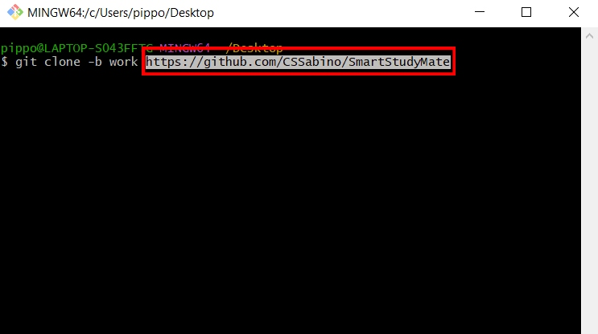
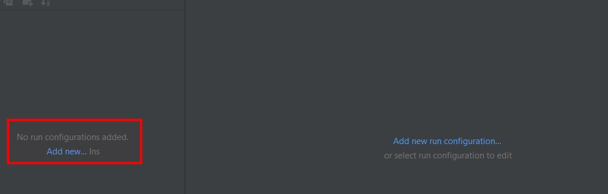
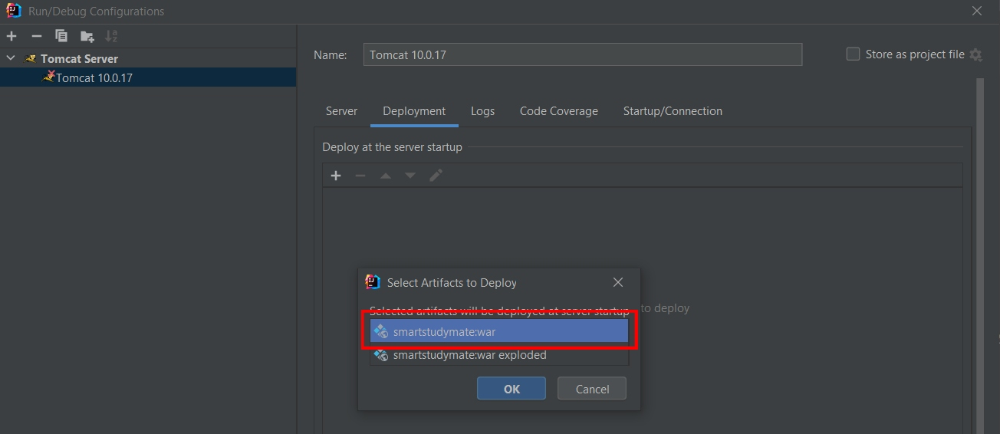
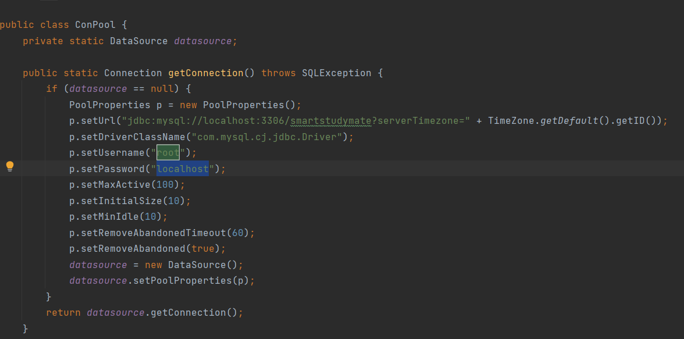

SmartStudyMate è il risultato dello studio di tesi condotto dallo studente Sabato Malafronte dell'Università degli Studi di Salerno.

L'oggetto della tesi è stato lo studio dell'uso di LangChain nella costruzione di applicazioni in ambito educativo che si basano sui Large Language Model.

Il nome "SmartStudyMate" nasce per il ruolo che svolge il software nel supporto agli studenti nel loro processo di apprendimento, come se si avesse a disposizione un amico intelligente al quale poter chiedere aiuto sugli argomenti trattati durante un corso. 

I docenti che hanno avuto modo di condurre corsi online ed hanno a disposizione le registrazioni delle proprie lezioni, possono caricare queste ultime su SmartStudyMate (SSM) e consentire ai propri studenti di poter interagire con il contenuto.

# Realizzazione di SmartStudyMate

SmartStudyMate è una web app prototipo che ha visto l’utilizzo di Java e Flask per lo sviluppo del back-end; HTML, CSS e JavaScript per il front-end. Il lavoro pi`u massiccio é svolto sicuramente dal programma realizzato con l’ausilio del linguaggio Python. Questa applicazione, sviluppata con il framework LangChain, contiene tutta la logica necessaria per l’interazione con ChatGPT.
Il software è stato sviluppato con l'IDE IntelliJ per la parte relativa al web, con l'IDE PyCharm per la parte relativa all'interazione con il modello di linguaggio.

# Installazione di SmartStudyMate

In questo paragrafo viene descritto il procedimento di installazione in locale di SmartStudyMate.

## Strumenti necessari

- Un ambiente di sviluppo (consigliati IntelliJ e PyCharm poichè oggetti dell'esempio di installazione);
- Python 3.11 (versione di sviluppo di SmartStudyMate);
- MySQL Workbench (per la creazione del database);
- Apache Tomcat 10.0.17 (web server).

## Clonazione della repository di GitHub

Di seguito viene fornito il link da inserire nella bash per la clone della repository remota sul proprio ambiente locale.

Link: https://github.com/CSSabino/SmartStudyMate

## Selezione del progetto clonato

Una volta clonato il progetto in locale, avvia l'IDE IntelliJ (o qualsiasi altro IDE) e cliccare su "Open" per aprire il progetto appena clonato:

Seleziona il progetto clonato e conferma:

## Creazione progetto su PyCharm

Apri l'IDE Pycharm (o qualsiasi altro IDE) e clicca su "New Project...":

Scegli un nome per il tuo progetto e clicca su "Create":

## Caricamento file sul progetto creato su PyCharm

Seleziona i file presenti nella cartella "langchain_ssm" e copiali all'interno del nuovo progetto creato:

Clicca su "install requirements" per installare i package necessari per l'esecuzione delle due applicazioni:

Attendi che i package vengo correttamente installati. Successivamente, passa su IntelliJ.

## Build del progetto

Attendi che il progetto venga correttamente caricato sull'IDE. Non appena il processo di caricamento è terminato, fare la "Build" del progetto:

## Aggiungi configurazione

Clicca su "Add configuration" per aggiungere una configurazione:

Aggiungi una nuova configurazione:

## Selezione del web server Apache Tomcat

Scegliere tra le configurazioni "Tomcat Server" e poi "Local":

Seleziona "Tomcat 10.0.17" come application server:

## Deployment del progetto

Sulla stessa interfaccia, apri la sezione per il deployment cliccando su "Deployment". Dopodiché, clicca su "+" e seleziona "Artifact":

### Selezione del file WAR

Seleziona il file con estensione war del progetto:

### Conferma le selezioni

Clicca su "Apply" e poi "Ok" per confermare le scelte di configurazione:

Passa adesso su PyCharm.

## Inserimento chiavi per utilizzo delle API

Apri i due file in formato Python copiati dal progetto clonato e sostituisci "personal_openai_api_key" con la tua chiave personale per l'utilizzo delle API di OpenAI:

Fai la stessa cosa per "personal_youtube_api_key" per utilizzare le API di YouTube:

## Creazione del database

Apri l'applicazione MySQL Worchbranch e seleziona la tua "MySQL Connection":

Clicca su "Open a SQL script" e seleziona il file "database.sql" dalla cartella "Database" del progetto clonato:

In questo momento hai lo script per la creazione del database necessario per SmartStusyMate. Ti basta solo eseguire lo script per crearlo:

Una volta creato il database, passa su Intellij.

## Cambia parametri di configurazione del database

Apri il file "ConPool" presente nel package "model" e modifica lo username e la password di connessione al database con quelli che fanno riferimento al tuo database:

# Esecuzione di SmartStudyMate

Ora che tutto il necessario è stato installato e configurato, non ti basta altro che mandare in esecuzione i due file Python su PyCharm ed il server Tomcat su IntelliJ ed iniziare ad utilizzare SmartStudyMate.

Apri il file python "smartstudymate_1" ed esegui il main:

Apri il file python "smartstudymate_2" ed esegui il main:

Esegui il web server Tomcat da IntelliJ:

